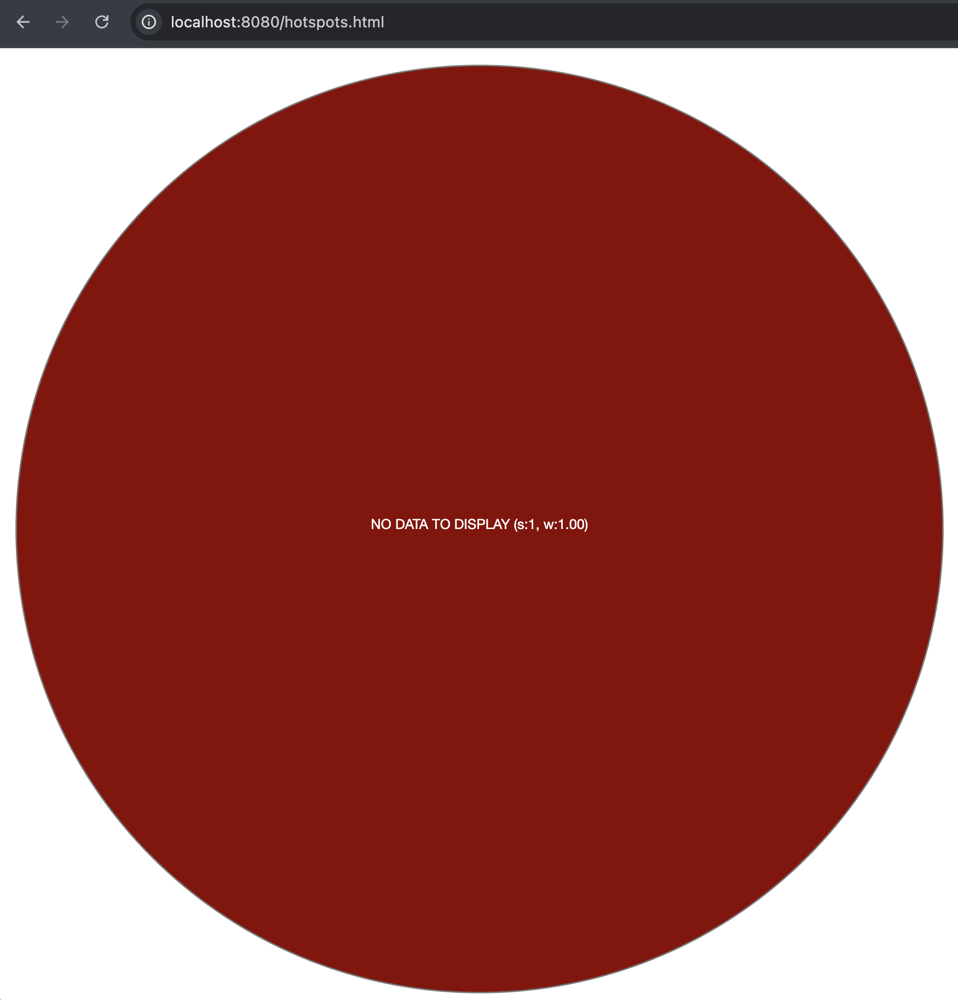
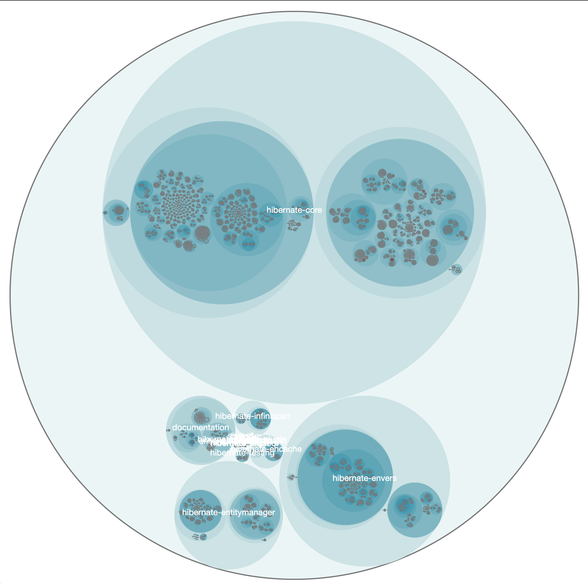

# 🔍 Let's find the hotsposts 🔴

This a step-by-step guide to perform code hotspots analysis as described in the book ["Your code as a crime scene"](https://pragprog.com/titles/atcrime2/your-code-as-a-crime-scene-second-edition/) by Adam Tornhill.

So, let's start!

First of all, we'll use a couple of tools in our analysis:

### Code Maat
Code Maat is a command line tool used to mine and analyze data from version-control systems. It works offline on your local machine.

Here you can find the github repo:
https://github.com/adamtornhill/code-maat

It's an executable jar (so you'll need Java to run it) that you can find in the codemaat directory.

You can run it by typing:

``` cmd
java -jar code-maat-0.8.5-standalone.jar
```

### Python
We'll use a couple of Pyhton scripts (that you can find in the script directory) to manipulate data and to start a lightweight http server for the visualization part.

You'll need Python installed on your machine. 
Both Python3 and Python2.

You can refer to the official website (https://www.python.org/) for installation instruction.
Take a look also at PyEnv (https://github.com/pyenv/pyenv) since you'll need to handle multiple versions of Python.

So here we are, let's start the investigation on our codebase 🔍

## 1 - Extract information with git log

Clone the repository you want to investigate if you haven't already done so.

Go inside the main directory of the repo and run this command:

``` cmd
git log --pretty=format:'[%h] %an %ad %s' --date=short --numstat > evolution_git.log
```
With this command we're extracting the git commit logs, formatting them and saving them to a file `evolution_git.log`.

If you want you can play with temporal windows here, for example 
``` cmd
git log --pretty=format:'[%h] %an %ad %s' --date=short --numstat  --before=2024-01-01 > evolution_git.log
```
will extract only the commits before 2024.

## 2 - Use Code Maat to get the revisions informations

Now that we have our `evolution_git.log` file we can use Code Maat to perform anlysis on it and extract informations about change frequiencies.

Copy Code Maat jar from the codemaat directory where you prefer and run:

``` cmd
java -jar <path_to_codemaat_jar>/code-maat-0.8.5-standalone.jar -l evolution_git.log -c git -a revisions > revisions.csv
``` 
This will generate a `revisions.csv` csv file containing all the informations about changes on files in your codebase.

If you're interested only in Java files you can clean the `revisions.csv` file by running the Pyton script `1_clean_revision.py` from the script folder.

For example:
```
python3 1_clean_revisions.py revisions.csv revisions_cleaned.csv
```
To run this script you may need to install Python `pandas` module.

This will generate a `revisions_cleaned.csv` file with the revisions of only Java files.

## 3 - Extract complexity using SonarQube

Now that we have all the informations on the effort dimension we should move to the complexity dimension.

In this guide we will use as a complexity metric the Cyclomatic Complexity extracted from SonarQube application.

In order to extract all the complexity informations from SonarQube you should run the Pyton script `2_extract_complexity_sonar.py` from the script folder.
```
python3 2_extract_complexity_sonar.py http://yoursonar.url project:name complexity.csv
```
Where:
- http://yoursonar.url is the url of you SonarQube installation
- project:name is the Project Key. You can find it in the Project Information page in SonarQube

This script will perform one or more API calls to SonarQube, extracting the informations about cyclomatic complexity, and create a csv file `complexity.csv` with all the files and their complexity sorted in descending order by complexity.

## 4 - Merging complexity and effort

Now it's time to merge effort and complexity in one final csv file that is the final outcome of our hotspot analysis.

To do that just execute the script `3_merge_revisions_complexity.py` from the script folder passing revisions and complexity files as input parameters.
```
python3 3_merge_revisions_complexity.py revisions_cleaned.csv complexity.csv hotspots.csv
```
This will generate the final report of our hotspot analysis: `hotspots.csv` .

In this file, you will find a list of all the files in your project sorted by the number of revisions in descending order.

**Use it as a guide to prioritize your maintenance and refactoring stuff!**
## 5 - Creating the data for the visualization

Ok, now we have the data about hotspots in our project but we want to see them live in a chart!

To do that we must transform our data and prepare them to be visualized. This can be done by running the script `4_create_json_for_visualization.py` from the script folder.

This script is very old, it comes from the "Your Code as a crime scene" book and for that reason it requires Python2.

**TIP**: You can use PyEnv to handle Python2 and Python 3 on your machine at the same time.

So just run this script with Python2:
```
python 4_create_json_for_visualization.py  --structure complexity.csv --weights revisions_cleaned.csv --weightcolumn 1 > hotspots.json
```
This will generate a file `hotspots.json` that we'll use in the next step to visualize the hotspots using circle packing and D3.js.

## 6 - Visualize the hotspots in our codebase

Go inside the visualization folder and run:
```
python3 -m http.server 8080
```
Now open you browser and go to this url:

http://localhost:8080/hotspots.html

You should see something like that:



This means that the visualization is up and running but there is no data to display.

Now copy the `hotspots.json` from the previous step inside the visualization folder overwriting the existing one.

Refresh the page at:

http://localhost:8080/hotspots.html

You should now see something like that 😱 (the picture below is an example taken from an hotspot analysis performed on Hibernate repository):



### 🔴 Those red circles are the hotspots in your codebase!
### 🎉 Enjoy and explore!
